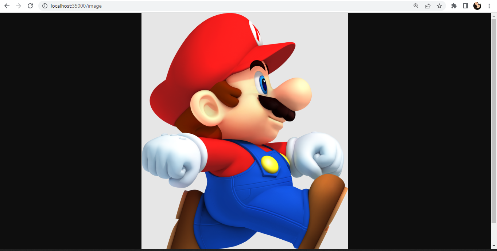
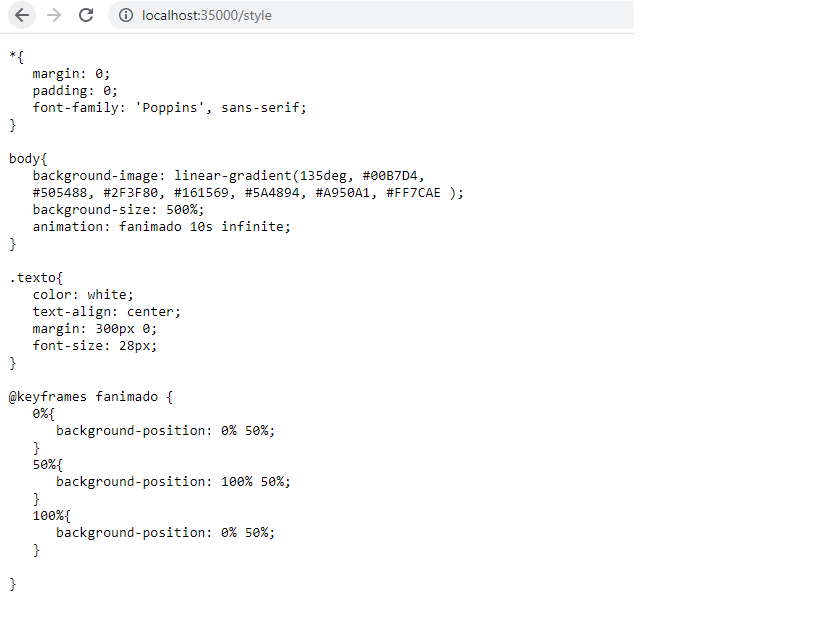
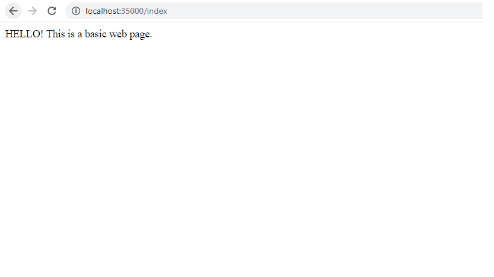

# LABORATORIO 4 AREP

En este laboratorio se creo un servidor Web (tipo Apachae) el cual es capaz de entregar páginas html e imagenes tipo PNG.

### Prerequisitos
* Maven: Herramienta para la gestión y construcción de proyectos.
* Java: Lenguaje de programación.
* Git: Sistema de control de versiones distribuido.


### Uso de la aplicación

Para poder correr el programa se deben seguir los siguientes pasos: 
* Clonar el respositorio con el comando

```
git clone https://github.com/danielagar320/LABORATOTIO04-AREP.git

```
* Ingresar a la capeta siguiente ruta y ejecutar la clase main

```
\src\main\java\edu\eci\arep\app\webApps 

```

* Entrar al browser que desee e ingresar la siguiente direccion: 

http://localhost:35000/  

puede ingresar index, style, image o main para ver los diferentes archivos.


### Test








### Autor

* **Daniela García Romero**:[danielagar320](https://github.com/danielagar320)


